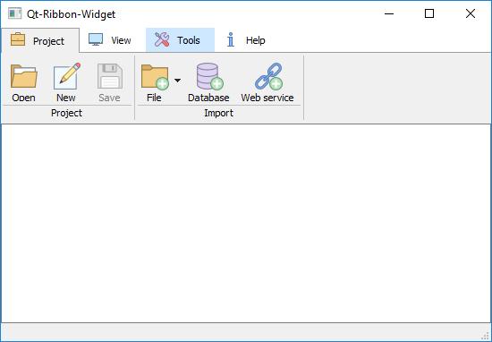
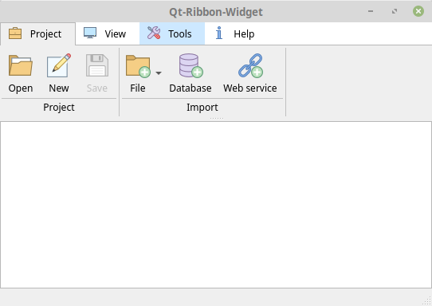

# Qt-Ribbon-Widget
A Ribbon widget for Qt





## Usage
1. Add the following files to your project:
* ribbon.h
* ribbon.cpp
* ribbonbuttongroup.h
* ribbonbuttongroup.cpp
* ribbonbuttongroup.ui
* ribbontabcontent.h
* ribbontabcontent.cpp
* ribbontabcontent.ui

2. Add a Ribbon to your window. The easiest way is to add a QTabWidget in QtDesigner and then promote this widget to a Ribbon.

3. In code, add tabs, button groups and buttons to the ribbon.

Add tab 'Project'
```
ui->ribbonTabWidget->addTab(QIcon(":/icons/briefcase_1.svg"), "Project");
```

Add button on tab 'Project' in group 'Project'
```
  QToolButton *openProjectButton = new QToolButton;
  openProjectButton->setText(tr("Open"));
  openProjectButton->setToolTip(tr("Open existing project"));
  openProjectButton->setIcon(QIcon(":/icons/live_folder_2.svg"));
  ui->ribbonTabWidget->addButton("Project", "Project", openProjectButton);
```

## License
This project is licensed under the GNU Lesser General Public License v3.0 - see the [LICENSE.md](LICENSE.md) file for details.

## Acknowledgments
- Icons from [icons8.com](https://icons8.com/)
